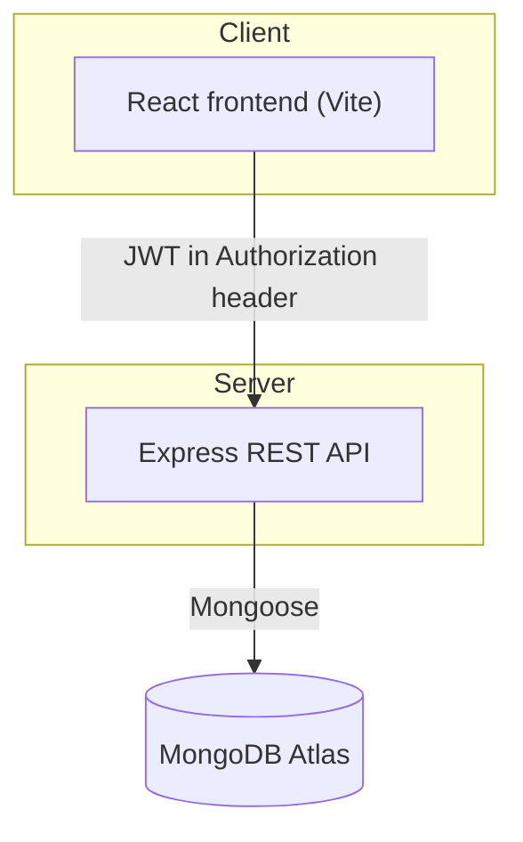

# Warehouse Stock Transfer Management

[](https://github.com/biswyaa28/backend_casestudy/actions/workflows/ci.yml)
[](LICENSE)

A full-stack case study app for managing stock transfers between warehouses.
Staff can browse stock and request transfers; managers approve or reject
requests, which is the only point at which stock actually moves.

## Contents

- [Architecture](#architecture)
- [Tech stack](#tech-stack)
- [Project structure](#project-structure)
- [Getting started](#getting-started)
- [Environment variables](#environment-variables)
- [API overview](#api-overview)
- [Testing](#testing)
- [Deployment](#deployment)
- [License](#license)

## Architecture



- The **frontend** is a plain React SPA. It never contains business logic -
  it only calls the REST API and renders whatever it gets back.
- The **backend** is a stateless Express API. Every protected route checks a
  JWT; manager-only routes additionally check the role encoded in that JWT.
- Stock only changes in one place: `approveTransfer` in
  [`backend/controllers/transferController.js`](backend/controllers/transferController.js).

## Tech stack

| Layer | Choices |
| --- | --- |
| Frontend | React, React Router, Axios, Vite |
| Backend | Node.js, Express.js, Mongoose |
| Database | MongoDB (Atlas) |
| Auth | JWT (`jsonwebtoken`), password hashing (`bcryptjs`) |
| CI | GitHub Actions (install + build checks on every push/PR) |

## Project structure

```
warehouse-stock-transfer/
├── backend/            Express REST API (see backend/README.md)
│   ├── config/          Database connection
│   ├── controllers/     Request handlers / business logic
│   ├── middleware/       Auth + role checks
│   ├── models/          Mongoose schemas
│   ├── routes/          Express routers
│   └── server.js        App entry point
├── frontend/            React SPA (Vite)
│   └── src/
│       ├── components/  Navbar, ProtectedRoute
│       └── pages/       Login, Dashboard, TransferForm, Approvals
└── .github/workflows/   CI pipeline
```

## Getting started

Requires Node.js 20.19+ (see `.nvmrc`) and a MongoDB connection string (local
or [Atlas](https://www.mongodb.com/cloud/atlas)).

```bash
git clone https://github.com/biswyaa28/backend_casestudy.git
cd backend_casestudy

# Backend
cd backend
npm install
cp .env.example .env     # then fill in real values
npm run dev               # http://localhost:5001

# Frontend (in a second terminal)
cd frontend
npm install
cp .env.example .env     # defaults already point at the backend above
npm run dev               # http://localhost:5173
```

Register your first user via `POST /api/auth/register` (Postman collection
included at `backend/postman_collection.json`) - there is no sign-up page in
the UI by design.

## Environment variables

| App | File | Variable | Meaning |
| --- | --- | --- | --- |
| Backend | `backend/.env` | `PORT` | Port Express listens on |
| Backend | `backend/.env` | `MONGO_URI` | MongoDB connection string |
| Backend | `backend/.env` | `JWT_SECRET` | Secret used to sign/verify login tokens |
| Backend | `backend/.env` | `FRONTEND_URL` | Origin allowed by CORS |
| Frontend | `frontend/.env` | `VITE_API_URL` | Base URL of the backend API |

Real `.env` files are git-ignored. Copy the matching `.env.example` in each
folder and fill in real values - never commit secrets.

## API overview

Full endpoint tables (method, path, who can access it) are in
[`backend/README.md`](backend/README.md). Summary:

| Resource | Base path | Public | Logged-in user | Manager only |
| --- | --- | --- | --- | --- |
| Auth | `/api/auth` | register, login | - | - |
| Warehouses | `/api/warehouses` | - | read | create, update, delete |
| Products | `/api/products` | - | read | create, update, delete |
| Transfers | `/api/transfers` | - | create, read | approve, reject |

## Testing

There is no automated test suite yet. The app was verified with:

- A scripted end-to-end HTTP check (register/login, CRUD permissions,
  stock-transfer approve/reject logic, status filters, edge cases).
- A real-browser (Playwright) walkthrough of the staff and manager flows.
- CI (`.github/workflows/ci.yml`) installs both apps and builds the frontend
  on every push/PR, catching dependency or build breakage.

See `backend/postman_collection.json` for manual API testing.

## Deployment

- **Backend → Render** (or any Node host): set `PORT`, `MONGO_URI`,
  `JWT_SECRET`, `FRONTEND_URL` (your deployed frontend URL) as environment
  variables.
- **Frontend → Vercel**: set `VITE_API_URL` to your deployed backend's
  `/api` URL. `frontend/vercel.json` already configures the SPA rewrite so
  client-side routes work on refresh.

## License

[MIT](LICENSE)
